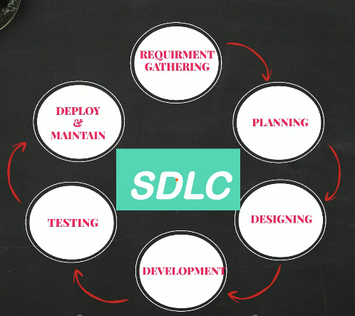

# What is Devops?

# 1.1 Introduction

### What is DevOps?

DevOps is **a set of cultural philosophies, practices, and tools that bridges the gap between software development (Dev) and IT operations (Ops) teams**. It aims to shorten the development lifecycle, delivering high-quality software faster through automation, continuous integration/continuous delivery (CI/CD), and shared responsibility. 

### Story:

Emma, is an artistic person. She has a passion of collecting art work. she have her own gallery where she sell to people. She want to expand her business through a mobile app so users throughout the world can access her gallery and make a purchase. She doesn't have a team to do that. She will need a team of  **Developers, testers, Sys Admin, etc etc..** To be able to achieve that.

Emma approaches a Software Consulting firm and explain her idea. Reggi, Director of Dev and Ops Team and introduced to her the process development, delivery, and service of software.  **Avi**, t**he project Manager** of Software Development Team and explain the Software Development process to Emma. **Freddy, Operations Head,**  explains to Emma how the mobile app will be hosted on the cloud server.

Emma, decided to sign the deal after meeting the team. She want to understand the development process. Emma doesn't have the full requirements and she would like to observe the process and edit through it. That's why Waterfall model is a No for her idea. The Dev team chooses Agile SDLC and get started. 

### Software Development Process

**1st Phase: Requirement (Gathering & Analysis):
Include:**

- Product Features
- Users
- Usage
- User Requirement
- Market State

**2nd Phase: Planning (What Do we Want?)
Include:** Determining the cost & resources required for implementation

- Cost
- Resources
- Risk

**3rd Phase: Designing (Architects)**

Based on input from previous phases, architects will produce design docs to work as guide for developers

**4rth Phase: Development (Developers):**
Software Development Based on inputs of design document.

**5th Phase: Testing ( QA):**
Identify the defects to ensure the quality product is good before pushed to production

**6th Phase: Deployment ( System Admin):**
Software is deployed to production stage so users can use it. Its the responsibility of System Admin and entire operation team to make sure the software is up & running all time.

**7th Phase: Maintenance ( Changes & Uptime):**
Its is a balance between regular  changes and uptime (Systems health,  performance, uptime with regular changes)

This whole process is called Software Development Lifecycle (SDLC)

### Models In SDLC:

- WaterFall
- Agile
- Spiral
- Big Bang
- Other

These models allow you to achieve the same goal or reach the desired destination by choosing the best model based on the factors such as cost, risk, available time to achieve the goal. 

**Water Fall Model:**
Each phase must be completed before the second one starts. You can only go to design phase if you have all requirements and you can go to implementation only if you have all design phase completed.

It is difficult to make changes in this model in case something wasn't thought off initially. The working software is produced very late in the lifecycle. It might take months.

**Agile Model:**

The way of dividing the SDLC into smaller list and work the way through it each iteration in a matter of 2-4 weeks. This helps to produce a **DEMO** to see if it is fitting after every iteration and based on **Feedback,**  new ideas/changes can be injected in the next iteration. SDLC put more stress on Ops team because there will be regular code changes, and it must be deployed to be tested by QA. This could happen several times in a single iteration and may result in overdue deadlines.

### DevOps - Breaking the Wall Between Dev & Ops

Development and Operations are both meant to support the product, but they work very differently.

### Development (Dev)

- Agile-driven
- Focused on rapid, frequent changes
- Optimized for speed and iteration

### Operations (Ops)

- ITIL-driven
- Focused on stability and control
- Optimized for reliability and risk reduction

Between these two teams, a “wall” exists.

Developers build features and throw the code “over the wall” to Ops.

Ops is then responsible for deploying and managing it in production.

### The Friction

- Developers complain about slow deployments.
- Ops complains about unclear instructions and incomplete handoffs.
- Customers experience delays and errors.
- Business impact increases.

The core issue: Dev is Agile, but Ops is still operating in a traditional waterfall mindset.

Success requires:

- Collaboration
- Clear communication
- Shared ownership
- Integrated processes

## What DevOps Actually Changes

### 1. Shared Understanding

- Dev team is trained on Ops concepts.
- Ops team is trained on Agile principles.
- Both teams begin speaking the same language.

### 2. Breaking the “Wall”

Instead of throwing code over to another team:

- Dev and Ops work together.
- Responsibility is shared across the delivery lifecycle.

### 3. Automation Everywhere

The most critical shift: automation across the entire code delivery pipeline.

This includes:

- Code builds
- Code testing
- Software testing
- Infrastructure changes
- Deployments
- Environment configuration
- Monitoring and feedback

Manual handoffs are replaced with automated, repeatable processes.

---

## The Outcome

DevOps transforms code delivery from: Slow + fragmented + blame-driven

to: Fast + collaborative + automated + reliable

Ultimately, this means:

- Faster releases
- Fewer errors
- Happier customers
- Reduced business risk
- Scalable growth

### SDLC:

