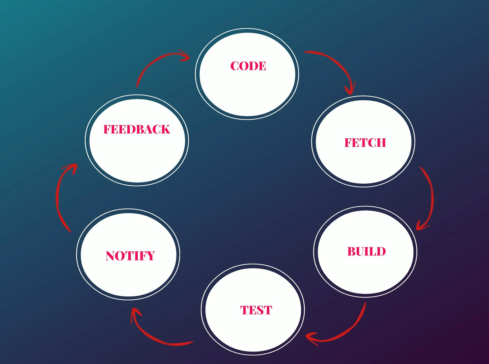

# What Is Continues Integration (CI)

# 1.2 What Is Continues Integration (CI):

Continues Integration is a DevOps Software Development practice where developers regularly merge their code changes into central repository, after which automated builds and tests are run.

Developers write several lines of codes while creating a software. Its an ideal practice to store the code in a centralized place/folder/Repository called **Version Control System** which is **Github.** This code will be moved to build server. On build server the code will be built, tested, and evaluated to create the software or called the artifact. It will be stored in a Software Repo. Based on the programming language, artifact/software packaging could be WAR/JAR (Java), DLL/EXE/MSI (Windows). or ZIP/TAR. Then it will be deployed into the server for testing, and once approved it will be pushed to production. 

## Why Continuous Integration (CI) Fix Problems Early

### The Problem: Late Integration

A team works on a software model for three straight weeks.

That’s a significant amount of code.

Once development pauses, the process kicks in:

- The build server fetches the code.
- The code is built.
- Tests are executed.

And then appears:

- Build failures
- Bugs
- Conflicts
- Integration errors

Now developers must:

- Revisit old code
- Rewrite multiple sections
- Fix defects introduced weeks earlier

This leads to heavy rework and wasted time.

The core issue:

Code was merged into the repository, but not truly integrated.

## Using Continuous Integration:

Instead of waiting weeks to build and test, the process should happen continuously.

After every single commit:

1. Code is automatically fetched.
2. It is built.
3. Automated tests are executed.
4. Notifications are sent if something fails.

## How CI Works

When a developer commits code:

1. An automated pipeline triggers immediately.
2. The system:
    - Pulls the latest code
    - Builds it
    - Runs automated tests
3. If something fails:
    - The developer is notified immediately.
    - The issue is fixed right away.
    - The code is committed again.
4. If everything passes:
    - The code is versioned.
    - It is stored in the software repository.
    - It becomes part of a stable, integrated codebase.

This cycle repeats continuously.

## Result

- Defects are caught immediately.
- Integration happens daily (or even multiple times a day).
- Rework is drastically reduced.
- The codebase stays stable.
- Teams move faster with less risk.

### IDE:

- Eclipse
- Visual Studio
- ATOM
- PYCharm

### Version Control:

- GIT
- SVN
- TFS
- Perforce

### Build Tools:

- MAVEN, ANT, GRADLE
- MSBUILD, VISUAL BUILD
- IBM URBAN CODE
- MAKE
- GRUNT

### Software Repository:

- SONATYPE NEXUS
- JEFROG ARTIFACTORY
- ARCHIVA
- CLOUDSMITH PACKAGE
- GRUNT

### CI Tools:

- JENKINS
- CIRCLECI
- TEAMCITY
- BAMBOO CI
- CRUISE CONTROL