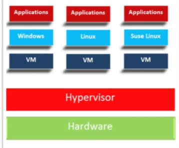

# What Is Virtualization

Life Before Virtualization:

- To run app/service ( such as TomCat, Apache Httpd, MySQL Database) we need Server
- Physical Computers were the only options ( act as Servers in Datacenter)
- One Service - One Server (Isolation)
- Servers are always overprovisioned (if 10GB is needed → aim for 12Gb)
- Server resources mostly underutilized
- Huge Cap EX & Op Ex

Then:

Enter VMware:

- It brought tools and allowed one computer to run multiple OS (Operating System)
- Partition physical resources in virtual resource (To run OS, you need physical computer. with virtualization, you can create virtual computer inside the physical computer and you can create as many as you want)
- Virtual Machines runs in isolated Env because each has its own OS
- Server virtualization is the most common virtualization

**Hardware** is your physical computer, and inside it, you have a tool called **Hypervisor**  which is a software that allows you to creates **VMs** and each VM can use a different OS and you can run the **Application/Service**

### Terminologies:

- **Host OS:** The operating system of the physical machine (which is your computer, weather its windows, macOS, etc)
- **Guest OS:** The operating system of the virtual machine. So **VM** can also be called **Guest OS**
- **VM:** A virtual machine (VM) is **a software-defined computer that emulates a physical machine**.
- **Snapshot**: Is the way of taking backup of the VM
- **Hypervisor:**  A lightweight software layer called a **hypervisor** sits between the physical hardware (the "host") and the virtual machine (the "guest"). The hypervisor allocates designated amounts of CPU, RAM, and hard drive space to the VM, treating those shared resources as an independent, standalone computer.

### Types of Hypervisors:

**Type 1:** Bare Metal

- Runs as Base OS
- Production (only used for production and wont let you use it for other purposes)
- Ex: VMware esxi, Xen Hypervisor

**Type 2:** 

- Runs a software
- For Learning & Testing
- Ex: Oracle VirtualBox, VMware server..