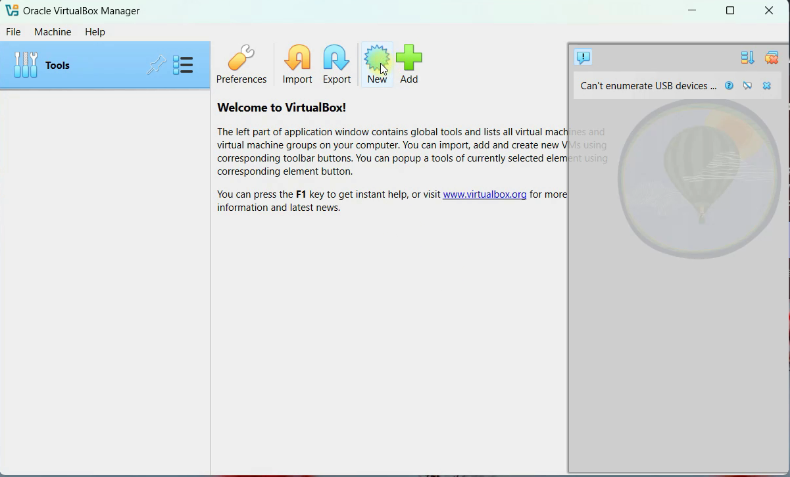

# VM Manually

### VM Manual Setup:

1 - Open the **Hypervisor,** in our case its **Oracle VirtualBox:**
2- To create new VM, click on the blue gear ⚙️ icon on top

3 - Give a name (It can be anything, but its better to name it as the OS that will be installed on it such as CentOS, Ubuntu, etc..)

- Type: Linux
- Subtype: Red Hat
- Version: Red Hat (64-bit). If you could`nt see 64-bit, it means Virtual Technology wasnt enabled in the BIOS, so you have to enable it.

4- Click on **Hardware** and select the memory to be **2048 MB** under **Base Memory**. This will depend on your available memory. The put **2 CPUs**  under  **Processors.**

5- Click on **Hard Disk,**  and select the size of the hard disk. This will create the file showing in the image in your computer. The value will be set 20GB as default but its not going to actually reserve 20GB from your disk. But if you ✔️ checked the  “**Pre-allocate Full Size”**  box, it will do so. Make sure its unchecked and it will dynamically allocate till it reached **20GB**

6 - We have so far create the VM, and now we need to install an OS on it. We will be installing CentOS OS.

7- Google `“centos stream 9 iso download”` because `“ISO”` is an image file and installing it in our VM will start installation of CentOS OS from this image file. Head to  [`https://mirror.stream.centos.org/9-stream/BaseOS/x86_64/iso/`](https://mirror.stream.centos.org/9-stream/BaseOS/x86_64/iso/) and click on [`https://mirror.stream.centos.org/9-stream/BaseOS/x86_64/iso/CentOS-Stream-9-20260518.0-x86_64-boot.iso`](https://mirror.stream.centos.org/9-stream/BaseOS/x86_64/iso/CentOS-Stream-9-20260518.0-x86_64-boot.iso) and it will download the image file on your computer

8- After installation of ISO image file. Open your **OVB**. Click on the **VM** you created and click on the yellow **Settings**  button on top, ensure you are on **“Expert”** section, then go to **Storage → Controler:IDE → Empty.**  Then click on the small blue magnifying glass, and click on **“Choose a Disk File”** and select the ISO image file we downloaded **`([CentOS-Stream-9-20260518.0-x86_64-boot.iso](https://mirror.stream.centos.org/9-stream/BaseOS/x86_64/iso/CentOS-Stream-9-20260518.0-x86_64-boot.iso))`** and ensure you ✔️ check the box **“Live CD/DVD”** and then click **“Ok”**

9- Go to **“Network”** section, and tap on  “Adapter 2”. keep “Adapter 1” as is bcz its default. check ✔️ **“Enable Network Adapter”**  and select from “Attached to:” to be “**Bridged Adapter”.**  The select the name to be your computer network adapter. So if you’re using Wifi, you will be using **Wireless Network Adapter** and if you’re using Ethernet cable, you have to select **Ethernet Cable Adapter”.** 

Then Check your computer network adapter and its IP address by opening **“CMD Prompt”** and run the command `ipconfig` . You will see the **IPv4 address** which is your computer one and **Default Gateway** which is your **Router** under Wireless LAN adapter Wifi section. You will see the 1st three digits are same **192..**

Bridged networking connects a virtual machine (VM) directly to the physical network through the host computer. The VM behaves like a separate device and receives its own IP address from the router. This allows the VM to communicate with other devices on the same network.

**10 -** Go to **System** → **Motherboard → Pointing Device →** Select **USB Tablet**  so your mouse can be visible in the **VM**

## Commands:

PowerShell Commands:

`ipconfig` — to check your computer network adapter and its IP address by opening

Now when you power on this VM, it will start the booting from this image file.

