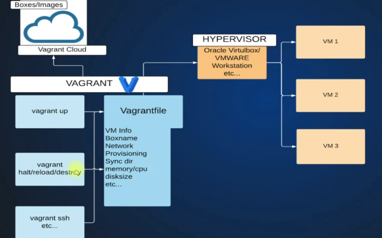

# VM Automatically

### VM - Automatic Setup

**Vagrant:** Vagrant is a non-graphical command tool ( using **GitBash**) used to **create, configure, and manage virtual machines automatically** using code instead of manual setup. It is not a replacement of the Hypervisor, but its a tool inside the Hypervisor to manage VMs. Vagrant helps automate VM setup and reduce time consuming setup, Manual → Human error, Tough to replicate multi vms, need to document entire steup.

**Vagrant architecture**.

```
You (Commands)
↓
Vagrant
↓
Provider (VirtualBox / VMware)
↓
Virtual Machine
↓
Guest Operating System
```



Steps to create VM using Vagrant:
1- Create folder in you computer

2- Place a “Vagrantfile” in that folder

3- issue the command `vagrant up` to start the VM

4- Use the command `vagrant ssh` to login into the VM

5- Use `vagrant halt` to power off the VM or use `vagrant destroy` to delete the VMSetup

#### Setup:

- Open GitBash and execute the command `pwd` to show the current working directory. The `~`  represent the home directory and changes as you move into folders and directories.
- execute the command `mkdir` to create a directory, with providing the destination of where this directory is created, we will use `mkdir /d/vagrant-practice` . So we created a folder called `vagrant-practice` in the drive `d`
- Now, we have to go inside that folder, so we use the command `cd` and then give the destination. So it will be `cd /d/vagrant-practice` .


- Now we will create two more folders inside the folder vagrant-practice
- `mkdir centos1` and `mkdir ubuntu1`
    
    
- Now we are inside the folder vagrant-practice and we created two folders, use the command `ls`  to list the folders inside it.
- Use the command clear to `clear` the page
- Now we need to get inside the folder centos1  to place the **vagrantfile** so we issue the command `cd centos1` assuming we are already inside the folder vagrant-practice

- To place the vagrantfile through the command `vagrant init boxname` we have to first find the boxname. hence, we head to [https://app.vagrantup.com](https://app.vagrantup.com/) and search for Centos 9. we will get list of ready made VMs, and in vagrant its called **Box.** we will click on  [**eurolinux-vagrant/centos-stream-9](https://portal.cloud.hashicorp.com/vagrant/discover/eurolinux-vagrant/centos-stream-9).**  Copy the name `eurolinux-vagrant/centos-stream-9`


- Head back to Gitbash and ensure you are inside `/d/vagrant-practice/centos1` . isseu the command `vagrant init eurolinux-vagrant/centos-stream-9` . Then you can issue the command `vagrant up.`
- If you got any error such as `Error: schannel: next InitializeSecurityContext      Vbox hardening` that is due to the antivirus. Disable it and `vagrant up` again


You can then issue the command `cat Vagrantfile` to read the content of the file

If you have any vpn connected, make sure you disable it as well.

If you’re in a corporate network, you’ll be behind a proxy server, and that will cause an issue. make sure you use different network.

- Now the Vagrant is up, vagrant downloaded the box and store it inside our local machine. We can run the command `vagrant box list` to see the downloaded boxes.
- Now that the vagrant is running, we need to login inside the VM, so we will use the command `vagrant ssh` and u’ll notice the command line changing from being your computer to a vagrant user. You can run the command `whoami` to see who is the user and it will show vagrant user. You can also run the command `sudo -i` to switch to the root user, `exit` to exit from the root user to vagrant user or from vagrant user to your computer. You can then run the commands `vagrant status` to check VM status or `vagrant global-status` to check all VMs status, `vagrant halt` to power it off, `vagrant destroy` to delete the VM, `vagrant global-status —-prune` to clear the VMS that are showing and they dont exist in the OVBM.


You can also run the command `vagrant status` to check the status of the VM if running or not 


## Commands:

### Raw Commands

- `pwd` — Show the current working directory.
- `mkdir` — Create a new directory/folder.
- `cd` — Change the current directory.
- `ls` — List files and folders in the current directory.
- `clear` — Clear the terminal screen.
- `cat` — Display the contents of a file.
- `whoami` — Display the current logged-in user.
- `sudo -i` — Switch to the root user (administrator mode).
- `exit` — Exit the current shell/session.

### Vagrant Commands

- `vagrant init [boxname]` — Initialize a Vagrant environment using a box.
- `vagrant up` — Start and provision the virtual machine.
- `vagrant ssh` — Log in to the running Vagrant virtual machine via SSH.
- `vagrant halt` — Shut down (power off) the virtual machine.
- `vagrant destroy` — Delete the virtual machine.
- `vagrant box list` — List all downloaded Vagrant boxes on the local machine.
- `vagrant status` — Check the status of the current virtual machine.
- `vagrant global-status` — Show the status of all Vagrant virtual machines.
- `vagrant global-status --prune` — Remove invalid or non-existing VM entries from global status.