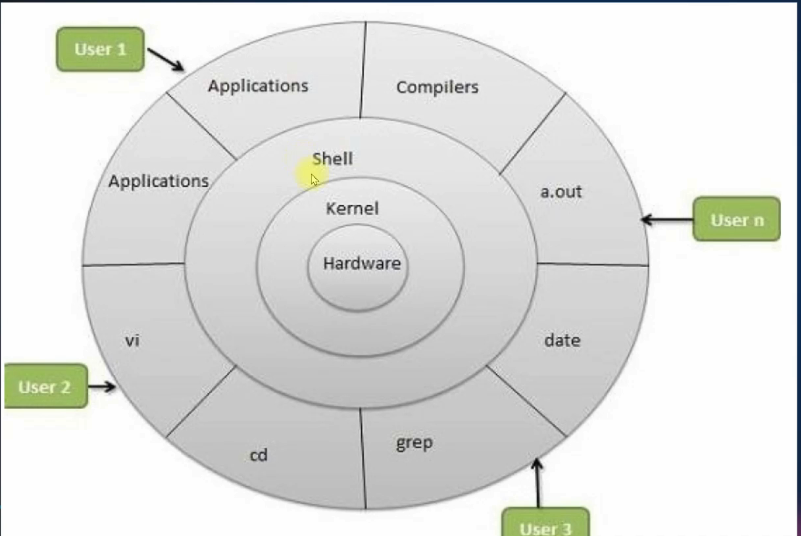

# Linux Intro

## What is Linux?

Linux is an **operating system** (OS). An operating system is the software that helps your computer work.

Think of Linux as the **manager of your computer**. It helps your apps, hardware, and files work together.

Examples of Linux systems are:

- Ubuntu
- Debian
- Fedora Linux
- Arch Linux

## Linux Principles:

- In Linux OS, everything is a file (including hardware such as keyboard, mouse, printer, etc..)
- Small single purpose programs
- Ability to chain/connect programs together for complex operations
- Avoid captive user interface (

In Linux and DevOps, **avoiding a “captive user interface” (UI)** is an important principle because systems should remain **scriptable, automatable, observable, and recoverable** without depending on a graphical or interactive interface.

A **captive UI** means you can only manage or operate something through a specific interactive interface (GUI, wizard, web console, or menu-driven tool), making automation and reproducibility difficult.)

- Configuration data stored in text file (means you can easily make changes in the file and no need to go to a settings page)

## Why Linux:

- Opensource
- Community Support
- Support Wide Variety of Hardware
- Customization
- Most Servers runs on Linux
- Automation (easy to do)
- Security

## Architecture of Linux:



“Architecture” means **how Linux is built and organized**.

Think of Linux like a **restaurant** 🍽️:

- **You (customer)** → User
- **Waiter** → Shell (takes your commands)
- **Kitchen manager** → Kernel (controls everything)
- **Kitchen machines** → Hardware (CPU, memory, disk, keyboard)

Linux has different layers.

Simple Linux Architecture:

```
+--------------------+
|     User / Apps    |
+--------------------+
|       Shell        |
+--------------------+
|       Kernel       |
+--------------------+
|      Hardware      |
+--------------------+
```

Let’s understand each layer.

---

### 1. Hardware (Bottom Layer)

This is the **physical part of the computer**.

Examples:

- CPU (brain of computer)
- RAM (memory)
- Hard disk / SSD (storage)
- Keyboard
- Mouse
- Screen

Linux uses these devices to make your computer work.

---

### 2. Kernel

Linux kernel is the **main core (heart/brain) of Linux**.

The kernel talks to the hardware and controls everything.

| Linux | Kernel |
| --- | --- |
| Complete operating system | Core part of OS |
| What users interact with | Talks to hardware |
| Includes many parts | One important part |

Simple meaning:

The kernel is like a **manager** between your software and hardware.

For example:

You open a file.

What happens?

1. You click the file
2. App sends request
3. **Kernel talks to hard disk**
4. File opens

Without the kernel, software **cannot talk directly to hardware**.

#### What does the Kernel do?

The kernel manages:

#### 1. Memory Management

It controls RAM.

Example:

If you open a browser and music app, kernel gives memory to both.

#### 2. Process Management

A process = a running program.

Example:

- Browser running
- Music player running
- Terminal running

Kernel manages all of them.

#### 3. Device Management

It controls devices like:

- Keyboard
- Mouse
- Printer
- USB

#### 4. File Management

It helps create, open, save, and delete files.

---

### 3. Shell (Command Helper)

The shell takes your commands and gives them to the kernel.

Example command: `ls`

You type: `ls`

The shell says to kernel:

> “Please show files.”
> 

Then the kernel gets information and shows it to you.

Popular shells:

- Bash (Unix shell)
- Z shell

Think of shell as a **translator between you and Linux**.

---

### 4. Applications (Top Layer)

These are programs you use.

Examples:

- Browser
- Text editor
- Music player
- Terminal

Apps ask the kernel for help.

Example:

Browser wants internet → asks kernel → kernel talks to network hardware.

---

#### **Easy Example: Playing a Song**

When you play a song:

```
Music App
    ↓
Shell / System
    ↓
Kernel
    ↓
Sound Hardware
    ↓
Speaker plays music
```

The kernel controls the communication.

---

### One-Line Summary

#### Linux Architecture:

Linux is built in layers:

**User → Applications → Shell → Kernel → Hardware**

#### Linux Kernel:

The kernel is the **heart of Linux**. It manages hardware, memory, files, and running programs.

#### Easy way to remember:

> **Kernel = Boss/Manager of Linux**
> 

Without the kernel, Linux cannot work.

A beginner sentence to remember:

> “The Linux kernel is the middle person that helps software talk to computer hardware.”
> 

## Popular Linux Distros

-→ Popular Desktop Linux OS

- Ubuntu Linux
- Linux Mint
- Arch Linux
- Fedora
- Debian
- OpenSuse

## Popular Server Linux OS

- Red Hat Enterprise Linux (most stable Linux OS) (Not opensource)
- Ubuntu Server
- Centos (opensource)
- SUSE Enterprise Linux

## Most Used Linux Distros In IT

RPM based: RHEL, Centos, Oracle Linux  — (software packaged in rpm format)

Debian based: Ubuntu Server, Kali Linux — (software packaged in deb format)

**The main difference between these families of OS, is the package method of the software**