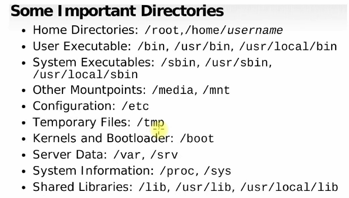

# Directories, Commands, & File System

## Directories:

**1 -  Home Directories:** `/root:`  Admin user in Linux and it has the power to do everything such as logging into users account, reset password, giving permission, etc.. Its directory is `/root` . Any other user will be `/home/username` such as `/home/vagrant`

**2- User Executable (any normal user can execute these commands):** `/bin`, `/usr/bin`, `/usr/local/bin` by going to these directories, you’ll find all the commands normal users can execute.

**3- System Executables:** `/sbin` , `/usr/sbin` , `/usr/local/sbin` to find all the commands the system admin such as root user can execute or if a user was given higher permission by root user, they can execute these commands. You can also create your own commands in `/usr/local/sbin` . `/sbin` is a symbolic link to `/usr/sbin`

**4- Other Mountpoints:** `/media`, `/mnt` if you connect external device such as CD or USB drive, it will be mounted in either one of these two commands. 

**5- Configuration:** `/etc` contains **static configuration files,** network configuration, server configuration, user configuration. Its primary purpose is system-wide settings for the OS and installed applications.

**6-Temporary Files:** `/tmp` any temporary files, data you would like to keep or loo at, you can visit or place them using this command. There is a chance of data being deleted when you reboot. 

**7- Kernels and Bootloader:** `/boot` 

**8- Server Data:**  `/var` , `/srv`  website server files you’re running such as HTML, you’ll place them in these directories

**9- System Information:**  `/proc` , `/sys`

**10- Shared Libraries:**  `/lib , /usr/bin, /usr/local/lib`

---

---

---

---

## Absolute Path & Relative Path:

**What is a path?** A path is a unique location to a file or a folder in a file system of an OS. A path to a file is a combination of / and alpha-numeric characters.

---

**Absolute Path** - An absolute path is the **full path from the root directory (`/`) to the destination**, regardless of where you currently are.

- Read it as: Start from the beginning of the filesystem and go step-by-step to the target directory.
- Example: `cd /home/vagrant/dev/project`
    - Read it as: Go from `/` → `home` → `vagrant` → `dev` → `project`.

Important Note: Absolute paths always start with `/` and work no matter what your current location is.

---

**Relative Path** - A relative path is a path based on **your current location (current directory)** instead of starting from `/`.

- Read it as: Move from where you are right now.
- Example: If you are in `/home/vagrant` and you run `cd dev`
    - Read it as: Go into the `dev` directory from the current location `/home/vagrant` .

> **Absolute Path vs Relative Path:**
> 
> 
> > Absolute paths are important because they are **independent of your current working directory.** A script using an absolute path will work no matter where the user is currently located in the system, whereas a relative path will break if the user moves to a different folder.
> > 

---

---

---

---

# Commands & File System:

- `whoami` : to display which user you are
- `pwd` : to list where are you or where is you location currently
- `ls` to list, list files, and directories of the location you’re in or a referred destination such as  `ls /testfile`  to list the content inside the `testfile`  directory
- `cat /etc/os-release` to read the file that has the system information and what version it is
- `cat`  - to read a file
- `[vagrant@localhost ~]$` - the symbol `~` means that you’re in the home directory of the vagrant user. `$` - means that this is a normal user shell.
- `[root@localhost ~]#` you will notice the dollar sign changed to hash `#` and this means its root user shell.
- If you run `cd /` this will take you to the root directory of the system
- `touch` - create empty file or change file time stamp
    - Using Brace `{}` generate a sequence of values before the command runs                 `command prefix{start..end}suffix` . For ex: `touch file{1..5}`  will create `file1 file2 file3 file4 file5` . you can also use letters. This is called **Brace expansion**
- **`mv` Command (Move / Rename)** To rename a file/directory, ensure its not open somewhere else other wise you’ll get “Permission denied” Syntax: `mv <source> <destination>`
    - Example mistake: `mv file1/ops /home/vagrant`
    - Problem: Linux interprets this as “move `ops` inside `file1`”, but `file1` is a file, not a directory.
- Running `cp`  will copy the file to a destination. You cant copy directories with `cp` alone, you have to use `-r` with it. Thats why we get error.
    - Example: `mv file1 ops/`
        - Read it as: Move `file1` into the `ops` directory.
    - Example: `mv ops/file1 .`
        - Read it as: Move `file1` from `ops` into the current directory (`.`)
            
            `.` — Read it as: The current directory.
            

---

---

---

---

# Linux Command Syntax:

A good way to think about Linux command syntax is:

**Syntax:** `command + [options] + [arguments]`

**Read it as:** Run a command, optionally modify its behavior, and optionally specify what it should act on.

Example: `ls -la /d/DevOps`

**Read it as:** List (`ls`) all files (`-a`) in long format (`-l`) inside `/d/DevOps`.

---

### Main Parts of a Linux Command

#### 1. Command (The Action)

What it is: The command is the program or action you want Linux to execute.

Examples: `ls` — Read it as: List files and directories.

`pwd` — Read it as: Print the current working directory.

`mkdir` — Read it as: Create a new directory.

`touch` — Read it as: Create an empty file.

Purpose: Think of the command as the answer to the question:

> *“What action do I want to perform?”*
> 

---

#### 2. Options / Flags (Modify Behavior)

**What it is:** Options change how a command behaves or how its output is displayed.

- **Short Options** (`x`)

What it is: Single-letter flags prefixed with `-`.

Examples: `ls -a` — Read it as: List all files, including hidden files.

`rm -r folder` — Read it as: Remove the folder recursively.

Purpose: Modify or extend the command behavior.

- **Combined Short Options**

What it is: Multiple short flags can often be combined into one group.

`ls -la` — Read it as: List all files (`-a`) in long format (`-l`).

Example: `ls -la` — Read it as: Same as `ls -l -a`.

Example: `rm -riv folder` — Read it as: Remove recursively (`-r`), ask before deleting (`-i`), and show what is removed (`-v`).

Purpose: Save typing and keep commands concise.

- **Long Options (`-word`)**

What it is: More descriptive option names prefixed with `--`.

Examples: `rm --recursive folder` — Read it as: Remove the folder recursively.

`rm --interactive file.txt` — Read it as: Ask for confirmation before deleting `file.txt`.

`ls --all` — Read it as: List all files, including hidden ones.

Purpose: Improve readability and clarity, especially in documentation.

---

#### 3. Arguments (The Target/Input)

What it is: Arguments tell the command what file, folder, or object to operate on.

Examples: `ls Documents` — Read it as: List the contents of the `Documents` folder.

`rm file.txt` — Read it as: Remove `file.txt`.

`cd DevOps` — Read it as: Change into the `DevOps` directory.

**Multiple Arguments**

What it is: A command can operate on several targets at once.

Example: `rm 1 2 3` — Read it as: Remove items named `1`, `2`, and `3`.

Example: `touch file1 file2 file3` — Read it as: Create empty files named `file1`, `file2`, and `file3`.

Purpose: Save time by performing the same action on multiple items in one command.

---

#### Command Reading Rule

**What it is:** A simple way to understand any Linux command.

Ask yourself:

1. **What is the command?** — What action is happening?
2. **What are the options?** — How is the behavior modified?
3. **What are the arguments?** — What is the target?

Example: `cp -rv project backup/`

**Read it as:** Copy (`cp`) the `project` folder recursively (`-r`) with verbose output (`-v`) into `backup/`.

---

---

---

---

# Command Type

### 1. Command Only

Used when no options or target are needed.

`pwd`

**Read it as:** Print the current working directory.

---

### 2. Command + Options

Used when modifying how the command behaves.

`ls -la`

**Read it as:** List all files (`-a`) in long format (`-l`).

---

### 3. Command + Argument

Used when operating on a specific target.

`cd DevOps`

**Read it as:** Change directory to `DevOps`.

---

### 4. Command + Options + Arguments

The most common command structure.

`rm -ri folder`

**Read it as:** Remove (`rm`) the folder recursively (`-r`) and ask for confirmation before each deletion (`-i`).

---

### 5. Command with Multiple Arguments

Used to operate on several targets at once.

`touch file1 file2 file3`

**Read it as:** Create empty files named `file1`, `file2`, and `file3`.

---

### 6. Command Using Wildcards (Globbing)

Used to match patterns of files.

`rm *.txt`

**Read it as:** Remove all files ending in `.txt`.

`ls file?.txt`

**Read it as:** List files matching `file1.txt`, `fileA.txt`, etc. (one character in place of `?`).

---

### 7. Command Using Brace Expansion

Used to generate sequences automatically.

`touch file{1..5}.txt`

**Read it as:** Create files named `file1.txt` through `file5.txt`.

`mkdir week{1..4}`

**Read it as:** Create directories named `week1` to `week4`.

---

### 8. Commands with Pipes

Used to pass output from one command to another.

`history | tail -10`

**Read it as:** Show command history, then display only the last 10 entries.

`ls | less`

**Read it as:** List files and open the result in a scrollable viewer.

---

### 9. Commands with Redirection

Used to save or redirect output.

`ls > files.txt`

**Read it as:** Save the output of `ls` into `files.txt` (overwrite if it exists).

`echo hello >> notes.txt`

**Read it as:** Add the word `hello` to the end of `notes.txt`.

---

### 10. Command Substitution

Used to run a command inside another command.

`echo $(pwd)`

**Read it as:** Run `pwd` first, then print its output.

`cd "$(dirname file.txt)"`

**Read it as:** Change directory to the folder containing `file.txt`.